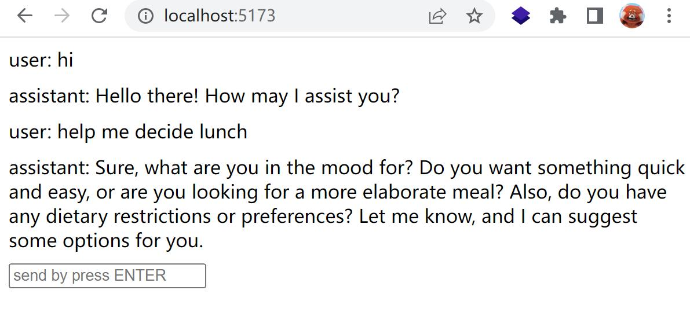

# My Dead Simple OpenAI Project

## Getting Started

To get started with this project, you'll need to have an OpenAI API key. If you don't already have one, you can sign up for a free account at [OpenAI.com](https://openai.com/). Once you have your API key, create a new file in the root directory of your project called `.env`. Add your API key to this file, like this

Then start the vite server by `npm run start`

## Screenshot

